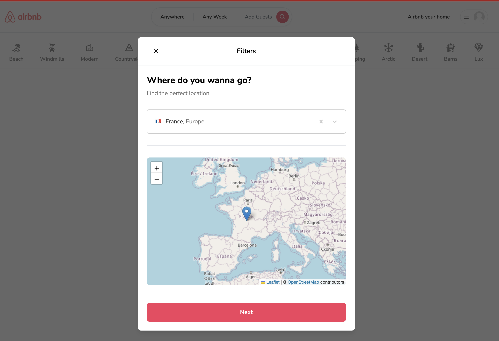

# Full Stack Airbnb Clone with Next.js 13 App Router: React, Tailwind, Prisma, MongoDB, NextAuth 2023

This is a repository for a FullStack Airbnb App using React, NextJS, TailwindCSS & Prisma.

💻 Screen Shoo t💻

# Features:

1. Tailwind design
2. Tailwind animations and effects
3. Full responsiveness
4. Credential authentication
5. Google authentication
6. Github authentication
7. Image upload using Cloudinary CDN
8. Client form validation and handling using react-hook-form
9. Server error handling using react-toast
10. Calendars with react-date-range
11. Page loading state
12. Page empty state
13. Booking / Reservation system
14. Guest reservation cancellation
15. Owner reservation cancellation
16. Creation and deletion of properties
17. Pricing calculation
18. Advanced search algorithm by category, date range, map location, number of guests, rooms and bathrooms
19. For example we will filter out properties that have a reservation in your desired date range to travel
    Favorites system
20. Shareable URL filters
21. Lets say you select a category, location and date range, you will be able to share URL with a logged out friend in another browser and they will see the same results
22. How to write POST and DELETE routes in route handlers (app/api)
23. How to fetch data in server react components by directly accessing database (WITHOUT API! like Magic!)
24. How to handle files like error.tsx and loading.tsx which are new Next 13 templating files to unify loading and error handling
25. How to handle relations between Server and Child components!

🛰️ 🌐 🗄 📡 Technologies
Next 13 (App Router)
React
Tailwind
Prisma
MongoDB

🌐 Prisma intallaiton : 0. npx prisma init
Next steps:

1. Set the "DATABASE_URL" in the .env file to point to your existing database. If your database has no tables yet, read https://pris.ly/d/getting-started
2. Set the provider of the datasource block in schema.prisma to match your database: "postgresql", "mysql", "sqlite", "sqlserver", mongodb or cockroachdb.
3. Run npx prisma db pull to turn your database schema into a Prisma schema.
4. Run npx prisma db push to turn your schema into a database.
   sambadiallo@mamadou ===> src % npx prisma db push
   Environment variables loaded from ../.env
   Prisma schema loaded from prisma/schema.prisma
   Datasource "db": MongoDB database "airbnbdb" at "shoeshop.0ybin.mongodb.net"
   Applying the following changes:

5. Run npx prisma generate to generate the Prisma Client. You can then start querying your database.
   More information in our documentation:
   https://pris.ly/d/getting-started

🔐 Setup .env file
DATABASE_URL=
NEXTAUTH_JWT_SECRET=
NEXTAUTH_SECRET=
